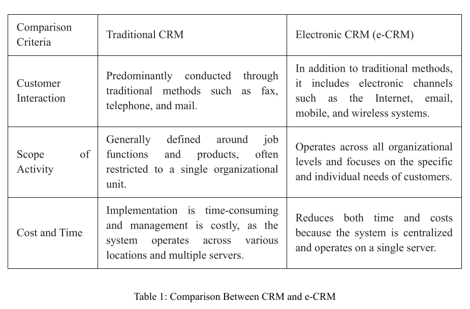
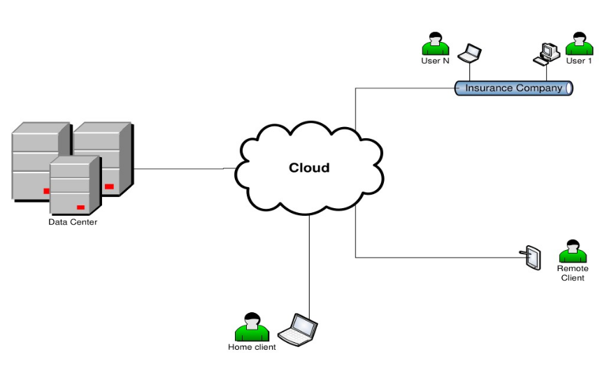

# Customer Relationship Management as a Service (CRMaaS)
### A Cloud Computing Perspective on CRM in the Insurance Industry (2012 / ۱۳۹۱)

---

## 🌍 Languages / زبان‌ها
* [English](#english-version)
* [Deutsch (German)](#deutsche-version)

---

## 🇬🇧 English Version

### 📝 Abstract
The insurance industry consists of a group of companies providing essential services. However, the Iranian insurance industry lacks a unified software for managing customer relationships. This paper, written in **2012 (۱۳۹۱)**, proposes a model for CRM software operating under cloud computing technology (CRMaaS), representing CRM as a suite of service offerings where customer demands are viewed as specific service requests.

**Keywords:** Insurance Industry, CRM, Cloud Computing, e-CRM.

### 1. Introduction
Traditional communication and isolated CRM databases in agencies lead to a lack of centralized oversight. We propose **'Electronic Customer Relationship Management as a Service (e-CRMaaS)'** tailored for the insurance industry.

### 2. CRM vs. e-CRM
**Table 1: Comparison Between CRM and e-CRM**

### 3. The Proposed Model

### 4. 📞 Contact Information
* **Institution:** Iran University of Science and Technology (IUST)
* **Address:** Daneshgah St., Hengam St., Resalat Sq., Tehran, Iran.
* **Tel:** +98 21 77240449
* **Fax:** +98 21 77240447
* **Postal Code:** 16846-13114
* **Email:** research@iust.ac.ir

---

## 🇩🇪 Deutsche Version

### 📝 Zusammenfassung (Abstract)
Die Versicherungsbranche bietet wesentliche Dienstleistungen an, jedoch fehlt eine einheitliche Software für das Kundenbeziehungsmanagement. Diese Arbeit (verfasst **2012 / ۱۳۹۱**) schlägt ein Modell für CRM-Software vor, die unter Cloud-Computing-Technologie (CRMaaS) betrieben wird.

**Schlüsselwörter:** Versicherungswirtschaft, CRM, Cloud Computing, e-CRM.

### 1. Einleitung
Traditionelle Kommunikation und isolierte CRM-Datenbanken führen zu einem Mangel an zentraler Aufsicht. Wir schlagen **'Electronic Customer Relationship Management as a Service (e-CRMaaS)'** vor.

### 2. Tabelle 1: Vergleich zwischen CRM und e-CRM

### 3. Das vorgeschlagene Modell

### 4. 📞 Kontaktinformationen
* **Institution:** Iranische Universität für Wissenschaft und Technik (IUST)
* **Adresse:** Daneshgah St., Hengam St., Resalat Sq., Teheran, Iran.
* **Tel:** +98 21 77240449
* **Fax:** +98 21 77240447
* **Postleitzahl:** 16846-13114
* **E-Mail:** research@iust.ac.ir

---

## 🎓 Publication & Indexing
Presented at **The 2nd Specialized Conference and Exhibition on Electronic Insurance**.
* **Date of Work:** 2012 (۱۳۹۱)
* **Official Website:** [www.eiconference.ir](http://www.eiconference.ir)

## 📚 How to Cite / Zitierweise
Goudarzi, S., Teymournejad, A., & Khajavi, H. (2012). *Customer Relationship Management as a Service (CRMaaS): A Cloud Computing Perspective on CRM in the Insurance Industry*. The 2nd Specialized Conference and Exhibition on Electronic Insurance.
